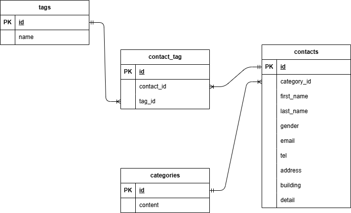

# COACHTECH お問い合わせフォーム

## 概要

本プロジェクトは、一般ユーザーからの問い合わせ受付機能および管理者による問い合わせデータ管理を行うWebアプリケーションです。
Traditional Web (SSR) 構成をベースとし、基本機能に加えてデータエクスポートや外部連携用の REST API（応用機能）を実装しています。

### 実装機能一覧

#### 【一般ユーザー向け機能】

- **お問い合わせ入力ページ** (`/`)
    - 入力項目（姓・名・性別・メール・電話・住所・建物名・内容）の入力
    - カテゴリ（ドロップダウン選択）およびタグ（チェックボックス複数選択）の設定
    - FormRequest によるリアルタイムなバリデーション表示
- **お問い合わせ確認ページ** (`/contacts/confirm`)
    - 入力内容の確認表示（性別・カテゴリ・タグは名称表示）
    - 「送信」によるデータ保存、または「修正」による入力画面へのリダイレクト（入力値保持）
- **サンクスページ** (`/thanks`)
    - 送信完了メッセージの表示およびトップページへの導線

#### 【管理者向け機能】

- **管理者登録・ログイン・ログアウト** (`/register`, `/login`, `/logout`)
    - Laravel Fortify を活用した認証機能
- **管理画面（お問い合わせ一覧）** (`/admin`)
    - お問い合わせ一覧表示（7件ずつのページネーション）
    - 条件検索（名前・メール・性別・カテゴリ・日付による絞り込み）
    - 検索条件のリセット機能
    - **【応用】CSVエクスポート機能** (`/contacts/export`)：検索結果をBOM付きCSVとしてダウンロード
- **お問い合わせ詳細・削除** (`/admin/contacts/{contact}`)
    - 問い合わせ詳細情報の表示およびデータ削除
- **タグ管理機能** (`/admin/tags`)
    - タグの新規追加・編集・削除

#### 【公開API機能（応用）】

- 外部連携用 REST API エンドポイント（CRUD操作対応、JSON形式レスポンス）

---

## 開発環境URL

- **Webアプリケーション**: [http://localhost](http://localhost)
- **phpMyAdmin**: [http://localhost:8080](http://localhost:8080)

---

## 使用技術

- **OS**: Linux (Docker環境)
- **言語 / 構成**: PHP 8.2 / Laravel 10.x
- **データベース**: MySQL 8.0
- **Webサーバー**: Nginx
- **フロントエンド**: Vite, Tailwind CSS ^3.4.0, Alpine.js
- **開発環境・管理ツール**: Docker, Laravel Sail, phpMyAdmin

---

## ER図



---

## APIエンドポイント一覧

認証不要の REST API エンドポイントを提供しています。

| HTTPメソッド | URI                          | 説明                                               |
| :----------- | :--------------------------- | :------------------------------------------------- |
| **GET**      | `/api/v1/contacts`           | お問い合わせ一覧取得（検索・ページネーション付き） |
| **GET**      | `/api/v1/contacts/{contact}` | お問い合わせ詳細取得（カテゴリ・タグ情報含む）     |
| **POST**     | `/api/v1/contacts`           | お問い合わせ新規作成                               |
| **PUT**      | `/api/v1/contacts/{contact}` | お問い合わせ更新                                   |
| **DELETE**   | `/api/v1/contacts/{contact}` | お問い合わせ削除                                   |

---

## 環境構築手順

### 1. リポジトリのクローン

本プロジェクトを GitHub からローカル環境へクローンします。

```bash
git clone git@github.com:kanai-naoki/reinstatement-check-test.git
cd reinstatement-check-test
```

_(※ HTTPS経由でクローンする場合は `git clone https://github.com/kanai-naoki/reinstatement-check-test.git`)_

### 2. 環境変数の設定 (`.env`)

`.env.example` をコピーして `.env` を作成します。

```bash
cp .env.example .env
```

`.env` 内のデータベース設定が以下の内容になっているか確認します：

```env
DB_CONNECTION=mysql
DB_HOST=mysql
DB_PORT=3306
DB_DATABASE=laravel
DB_USERNAME=sail
DB_PASSWORD=password
```

### 3. Composer パッケージのインストール

Docker イメージを経由して依存関係をインストールします。

```bash
docker run --rm \
    -u "$(id -u):$(id -g)" \
    -v "$(pwd):/var/www/html" \
    -w /var/www/html \
    -e COMPOSER_CACHE_DIR=/tmp/composer_cache \
    laravelsail/php82-composer:latest \
    composer install
```

### 4. Docker (Laravel Sail) の起動とエイリアス設定

Docker コンテナをバックグラウンドで起動します。

```bash
./vendor/bin/sail up -d
```

_(エイリアス設定)_

```bash
echo "alias sail='[ -f sail ] && bash sail || bash vendor/bin/sail'" >> ~/.bashrc
source ~/.bashrc
```

_※ 初回起動時や他環境での実行時にストレージの権限エラーが発生する場合は、以下のコマンドを実行してください。_

```bash
sail exec laravel.test chmod -R 777 storage bootstrap/cache
```

### 5. アプリケーションキーの生成

```bash
sail artisan key:generate
```

### 6. フロントエンドパッケージのインストールとビルド

```bash
sail npm install
sail npm run build
```

### 7. データベースマイグレーションおよび初期データの投入

```bash
sail artisan migrate --seed
```

### 8. テストの実行

以下のコマンドで自動テスト（PHPUnit / Pest）を実行します。

```bash
sail test
```

---

## 作成者

家内 直紀
